# Architekturdokumentation Tech-Radar Weblab
<!-- TOC -->
* [Architekturdokumentation Tech-Radar Weblab](#architekturdokumentation-tech-radar-weblab)
* [1. Einführung und Ziele](#1-einführung-und-ziele)
    * [Zweck:](#zweck)
    * [Hauptziele:](#hauptziele)
      * [Technologie-Stack](#technologie-stack)
      * [CI/CD & Automatisierung](#cicd--automatisierung)
  * [Aufgabenstellung](#aufgabenstellung)
  * [Qualitätsziele](#qualitätsziele)
* [2. Randbedingungen](#2-randbedingungen)
* [3. Kontextabgrenzung](#3-kontextabgrenzung)
  * [Geschäftskontext:](#geschäftskontext)
  * [Technischer Kontext:](#technischer-kontext)
    * [Akteure:](#akteure)
    * [Externe Systeme:](#externe-systeme)
* [4. Lösungsstrategie](#4-lösungsstrategie)
* [5. Bausteinsicht](#5-bausteinsicht)
  * [Context](#context)
  * [Container](#container)
    * [Tech Radar UI:](#tech-radar-ui)
    * [Tech Radar API:](#tech-radar-api)
    * [technologyRadar (DB)](#technologyradar-db)
  * [Component](#component)
    * [Tech Radar UI](#tech-radar-ui-1)
      * [Zusätzliche Beschreibung für TechRadarComponent](#zusätzliche-beschreibung-für-techradarcomponent)
    * [Tech Radar API](#tech-radar-api-1)
* [6. Laufzeitsicht](#6-laufzeitsicht)
  * [Scenario 1: Login Flow](#scenario-1-login-flow-)
  * [Scenario 2: Neuen Eintrag erstellen und direkt publizieren](#scenario-2-neuen-eintrag-erstellen-und-direkt-publizieren)
  * [Scenario 3: Neuen Entwurf erstellen](#scenario-3-neuen-entwurf-erstellen)
  * [Scenario 4: Eintrag anpassen](#scenario-4-eintrag-anpassen)
  * [Scenario 5: Entwurf anpassen](#scenario-5-entwurf-anpassen)
  * [Scenario 6: Entwurf publizieren](#scenario-6-entwurf-publizieren)
  * [Scenario 7: Eintrag löschen](#scenario-7-eintrag-löschen)
* [7. Verteilungssicht](#7-verteilungssicht-)
* [8. Querschnittliche Konzepte](#8-querschnittliche-konzepte)
  * [8.1 Dependency Injection (DI) für API und Datenbank](#81-dependency-injection-di-für-api-und-datenbank)
  * [8.2 Sicherheit](#82-sicherheit)
  * [8.3 Logging](#83-logging)
* [8.4 Fehlerhandling](#84-fehlerhandling)
* [8.5 Testing](#85-testing)
* [8.6 Performance-Optimierung](#86-performance-optimierung)
* [9. Architekturentscheidungen](#9-architekturentscheidungen)
  * [Entscheidung: Verwendung von NX Monorepo](#entscheidung-verwendung-von-nx-monorepo)
  * [Entscheidung: JWT-basierte Authentifizierung](#entscheidung-jwt-basierte-authentifizierung)
  * [Entscheidung Verwendung von Dependency Injection (DI) in API und DB-Schicht](#entscheidung-verwendung-von-dependency-injection-di-in-api-und-db-schicht)
  * [Entscheidung: Verwendung eines zentralen Logging-Services](#entscheidung-verwendung-eines-zentralen-logging-services)
  * [Entscheidung: Modularer Aufbau](#entscheidung-modularer-aufbau)
* [10. Qualitätsanforderungen](#10-qualitätsanforderungen)
* [11. Risiken und technische Schulden](#11-risiken-und-technische-schulden)
  * [11.1 Risiken](#111-risiken)
  * [11.1 Technical Depth](#111-technical-depth)
  * [Massnahmen](#massnahmen)
* [12. Glossar (generiert)](#12-glossar-generiert)
<!-- TOC -->

# 1. Einführung und Ziele

### Zweck:
Das Projekt WEBLAB_TechRadar implementiert eine Technologie-Radar-Anwendung für das HSLU Weblab-Modul. 
Sein Ziel ist es, eine Visualisierung verschiedener Technologien und Trends bereitzustellen, die Mitarbeiter und Leitungspositionen hilft, aufkommende Technologien zu bewerten und zu überwachen.

### Hauptziele:
- Eine dynamische Visualisierung von Technologietrends zu präsentieren.
- Bestehende Technologien bearbeiten zu können.
- Neue Technologien bearbeiten zu können.

#### Technologie-Stack
Für die Umsetzung des Projekts ist folgender Technologie-Stack vorgesehen:
* **Monorepo-Management**: Nx
* **Frontend**: Angular
* **Backend**: ExpressJS
* **Datenbank**: MongoDB
* **VCS**: GitHub Repo: https://github.com/RatedNextGen/WEBLAB_TechRadar

#### CI/CD & Automatisierung
Für die Entwicklung und Qualitätssicherung werden einfache Build- und Test-Stages mit GitHub Actions eingerichtet.
* Automatisierte Builds zur Sicherstellung der Konsistenz
* Tests zur Validierung der Codequalität
* **Kein** Deployment der Artefakte vorgesehen

## Aufgabenstellung

> Der Technologie-Radar ist ein passendes Werkzeug für Technologie-Management in einem Unternehmen, für ein Produkte-Team
> oder auch für sich als Software Architekt oder Software Engineer. Es gibt bereits verschiedene Umsetzungen von
> Technologie-Radare. Das prominenteste Beispiel ist der Technology Radar von ThoughtWorks.
>
> Dabei werden die einzelnen Technologien jeweils in sogn. vier Quadranten eingeordnet (Kategorien wie z.B. Techniques,
Tools, Platforms, Languages & Frameworks). Die Maturität wird über sogn. Ringe eingestuft (Assess, Trial, Adopt, Hold).
>
> Als Software-Anbieter möchten Sie den Technologie-Radar als Software as a Service anbieten. Der Technologie-Radar
besteht aus zwei elementaren Teilen:
>
> einer Technologie-Radar-Administration, in welcher die Technologien vom CTO oder einm Tech-Lead verwaltet werden können
>
> einem Technologie-Radar-Viewer, auf welcher der Technologie-Radar resp. die Technologien allen Mitarbeiter eingesehen
werden können.
>- [Allgemeine Anforderung des Projekts](https://github.com/web-programming-lab/web-programming-lab-projekt/blob/main/Technologie-Radar.md)

## Qualitätsziele

- **Modularität**: Einfache Erweiterbarkeit durch neue Komponenten oder Services.
- **Benutzerfreundlichkeit**: Intuitive Benutzeroberfläche mit klarer visueller Darstellung der Technologien.

# 2. Randbedingungen

| Kategorie         | Randbedingung         |
|-------------------|-----------------------|
| Technologie Stack | JavaScript/Typescript |

# 3. Kontextabgrenzung

## Geschäftskontext:
Das System dient als internes Instrument zur Verfolgung von Technologietrends und ermöglicht es Firmen, Strategien zur Einführung von Technologien zu prüfen, zu vergleichen und zu entscheiden.

## Technischer Kontext:
### Akteure:
- **Endbenutzer**: Mitarbeiter, die mit der Radarvisualisierung interagieren.
- **Admins**: CTO oder Tech-Leads die Technologie erstellen, entwerfen und bearbeiten.
- **Entwickler**: Pflegen und erweitern die Anwendung. 

### Externe Systeme:
- **GitHub + Actions** (Repository und CI/CD-Auslöser)s
- **Codecov** (Berichterstattung über die Abdeckung)

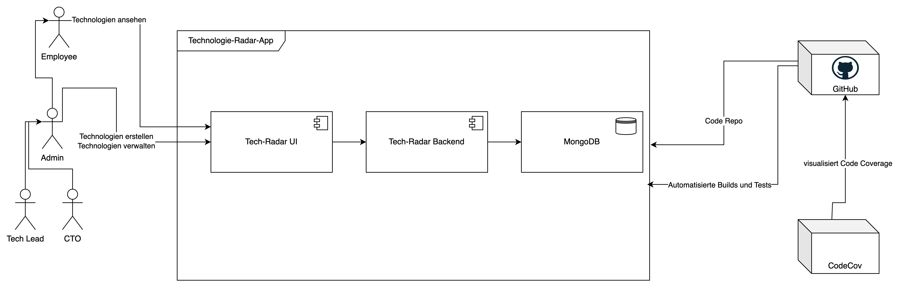

# 4. Lösungsstrategie

Die Lösung basiert auf einer Monorepo-Strategie, die mit NX verwaltet wird. Dieser Ansatz erleichtert die Arbeit:
- Separation of Concern: UI- und API-Projekte koexistieren innerhalb desselben Repositorys, sind aber logisch getrennt.
- Konsistenz: Einheitliches Tooling und einheitliche Konfiguration für alle Projekte (z. B. Testen, Erstellen, Linting).

Zu den wichtigsten Strategien gehören:
- **Shared Library**: Beinhaltet DTOs die vom Backend und vom Frontend geteilt werden, um Duplikation zu vermeiden-
- **Automatisiertes Testen**: Verwendung von Jest mit Istanbul für die Codeabdeckung.
- **Kontinuierliche Integration**: GitHub Actions zum Erstellen, Testen und Bereitstellen von UI- und API-Komponenten.
- **Modulare Architektur**: Nutzung des komponentenbasierten Designs von Angular und der Middleware-Architektur von Express.
- **Document-based Database**: Es wird MongoDB eingesetzt, da es flexibel und für die Komplexität des Projekts ausreicht, da keine Relationen benötigt werden.

# 5. Bausteinsicht

## Context
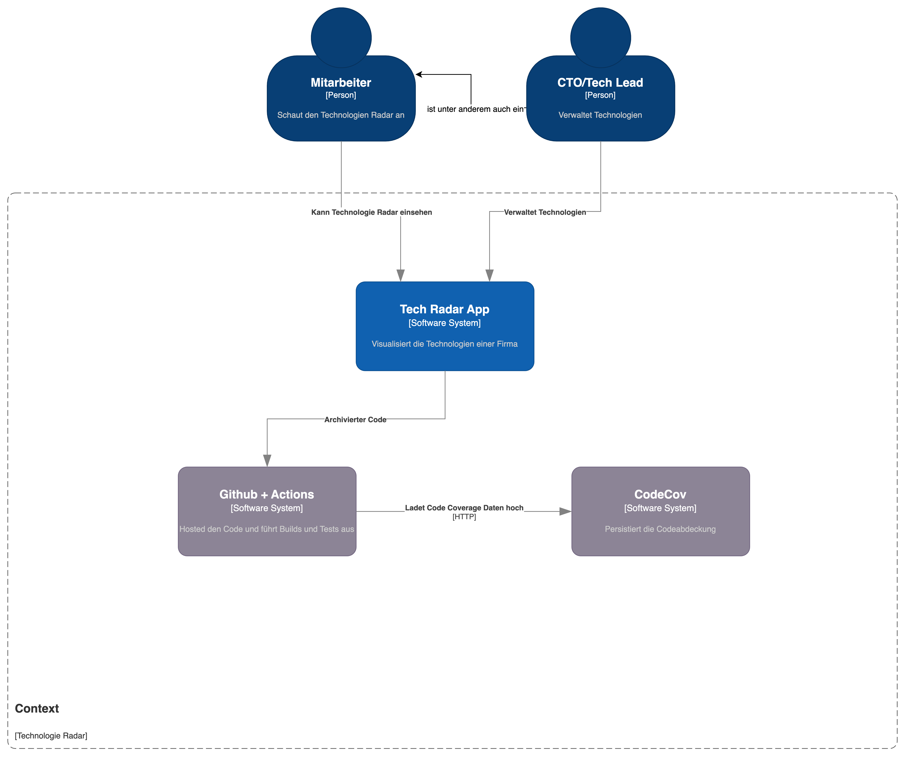

**Akteure**:
- **Endbenutzer**: Greift über den Browser auf die Angular UI zu.
- **Entwickler**: Arbeitet im Repository, führt Code-Commits und Reviews durch.

**System**:
- **Tech Radar App**: Beinhaltet die Angular UI und die Express API.

- **Externe Systeme**:
- GitHub Repository + Actions: Enthält den Quellcode, Automatisiert Builds, und Tests
- Codecov: Verarbeitet und visualisiert die Testabdeckung.

## Container

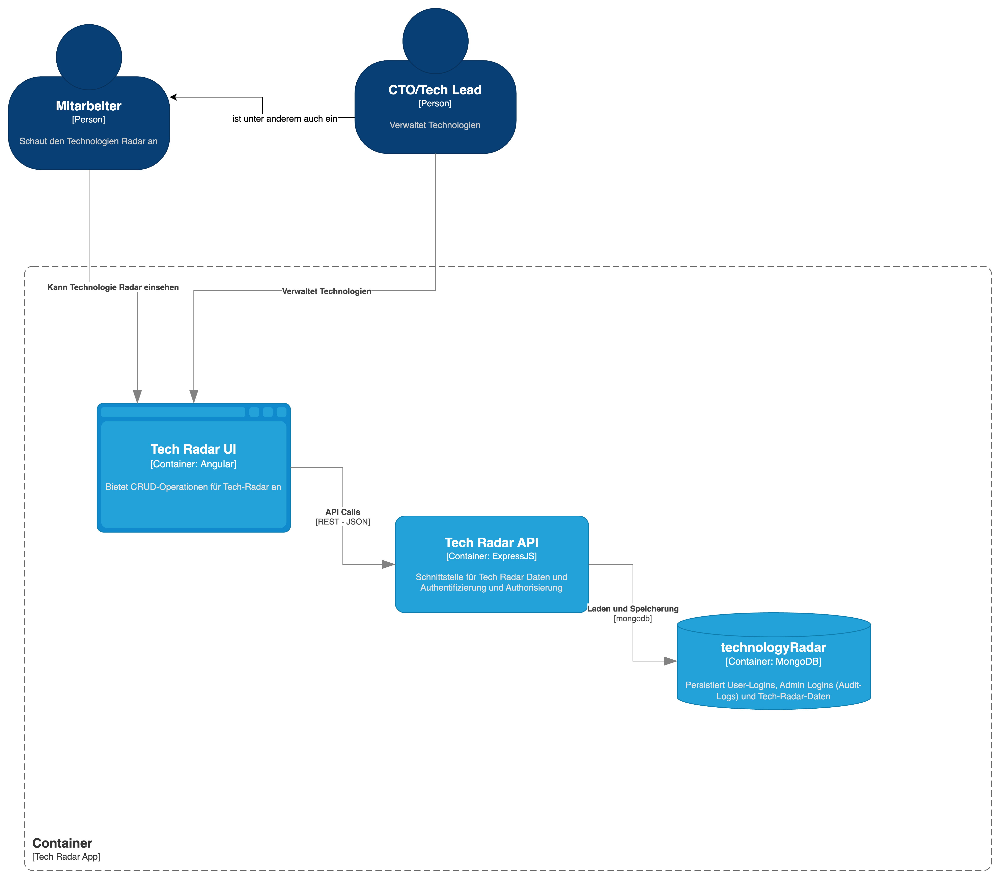

### Tech Radar UI:
- Verantwortlich für:
  - Für die Benutzeroberfläche, über die Benutzer den Technologie-Radar abrufen und interagieren können. Er ist für die Darstellung der visuellen Elemente, die Benutzerführung sowie die clientseitige Logik zuständig.
  - Er bietet Formulare für User mit der Rolle Tech-Lead/CTO an, damit die Technologie-Daten verwaltet werden können. 
- Kommunikation:
  - Es kommuniziert über REST-API-Aufrufe mit dem Backend (Tech Radar API), um Daten abzurufen oder Aktionen wie die Authentifizierung und Autorisierung auszuführen.

### Tech Radar API:
Verantwortlich für:
- Das Backend bildet die serverseitige Logik ab. 
  - Es stellt REST-Endpoints zur Verfügung:
    - für Authentifizierung (Login, Logout, Token-Info)
    - für den Abruf von Daten, die für den Radar benötigt werden.
    - für Änderungen der Technologie-Daten
    - für neue Technologie-Daten
  - Persistiert die Daten in der Datenbank. 

- Kommunikation:
  - Kommuniziert via REST mit dem UI und mit dem mongoDB Protokoll mit der Datenbank

### technologyRadar (DB)
Verantwortlich für:
- Die Persistierung von:
  - Login Daten
  - Technologie-Daten
  - Admin Logins (Audit Logs)

## Component

### Tech Radar UI
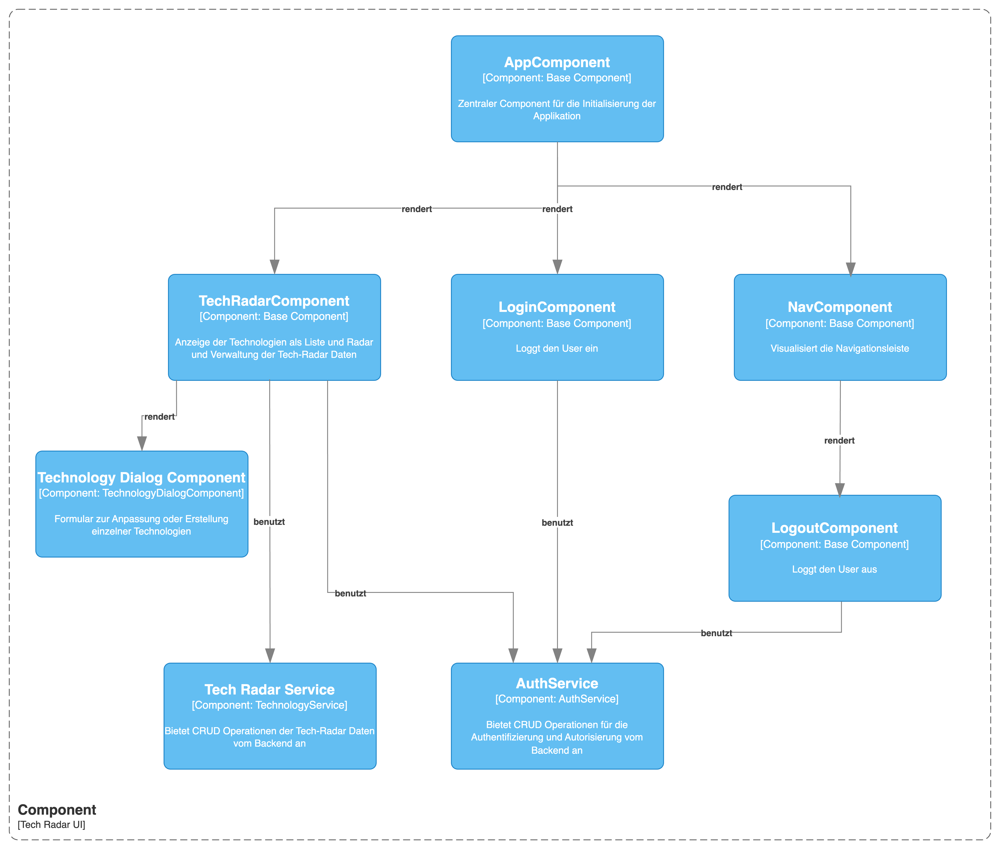

#### Zusätzliche Beschreibung für TechRadarComponent
Der TechRadarComponent ist die Basiskomponente der Tech-Radar Ansicht.
Er rendert weitere Komponenten, die für die Visualisierung der Tech-Radar-Daten zuständig sind – sowohl als Listenelemente als auch in Radarform.
Zudem ist der TechRadarComponent für das Laden der Tech-Radar-Daten verantwortlich und übernimmt die Kommunikation mit dem TechRadarService.
Eine Unterkomponente des TechRadarComponent, der TechnologyDialogComponent, stellt ein Formular bereit, das zur Erstellung neuer Tech-Radar-Daten sowie zur Bearbeitung bestehender Einträge dient.

### Tech Radar API
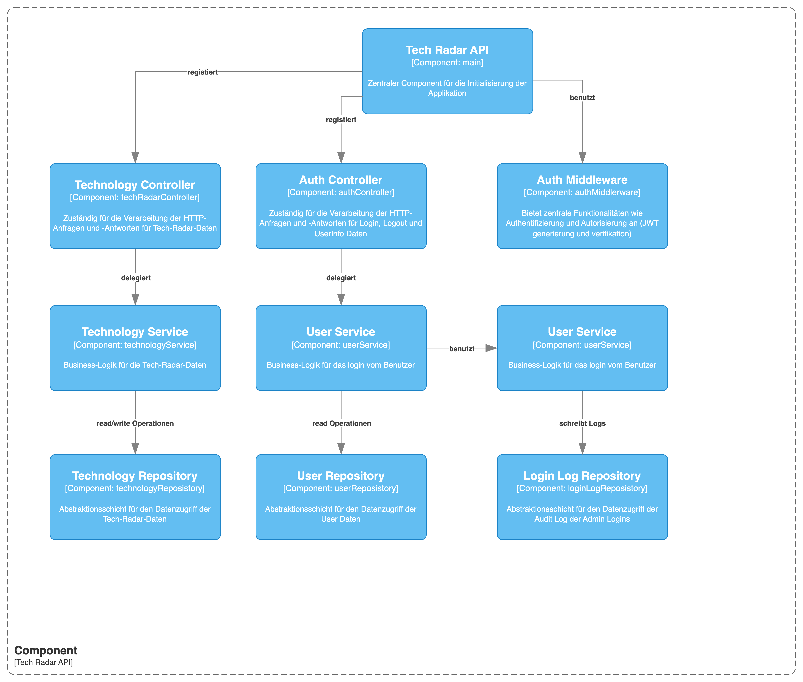

- Controller: Zuständig für die Verarbeitung der HTTP-Anfragen und -Antworten.
- Services: Kapseln die Geschäftslogik ab (z.B. Authentifizierung, Datenaufbereitung).
- Middleware: Bietet zentrale Funktionalitäten wie Authentifizierung.
- Repositories: Abstraktionsschicht für den Datenzugriff.

Speziell hier ist, dass der LoginLog Service lediglich für das Loggen von CTO/Tech-Leads Anmeldungen zuständig ist. Die Daten werden nur persistiert und nicht weiterverwertet.

Siehe [Laufzeitsicht](https://docs.arc42.org/section-6/) in der
online-Dokumentation (auf Englisch!).

# 6. Laufzeitsicht
## Scenario 1: Login Flow 
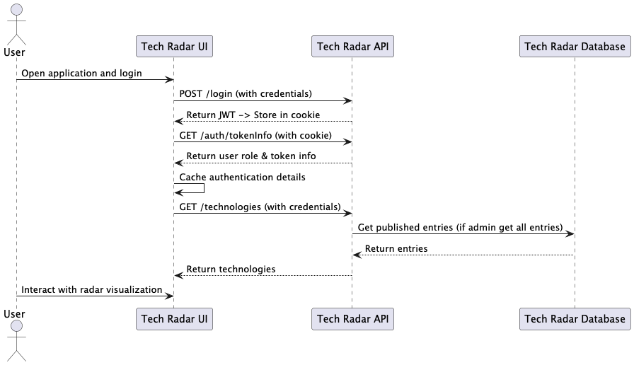

Der User meldet sich über das GUI mit E-Mail Adresse und Passwort ein. Die API überprüft, ob es sich um einen validen User handelt und, falls ja erstellt er ein JWT und gibt das als Cookie zurück.
Wenn er Login erfolgreich war, wird angefragt, welche Rolle der User hat. Wenn es sich um einen Mitarbeiter handelt werden CREATE, UPDATE und DELETE Operationen unterbunden.

## Scenario 2: Neuen Eintrag erstellen und direkt publizieren
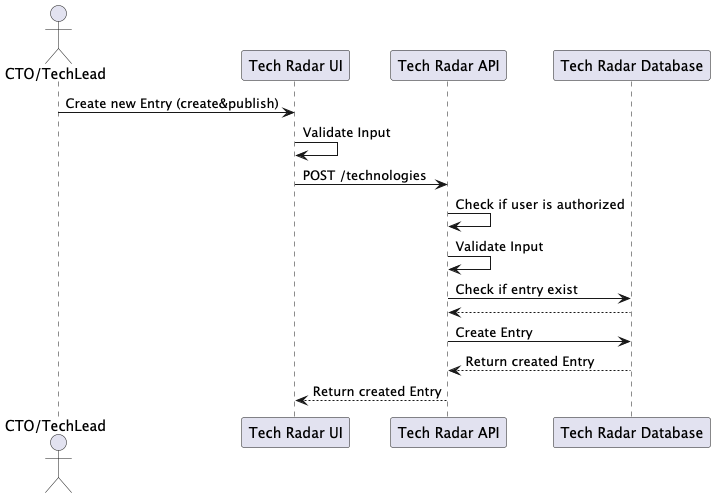
## Scenario 3: Neuen Entwurf erstellen
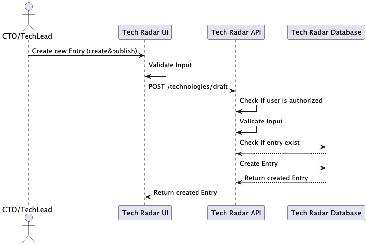
## Scenario 4: Eintrag anpassen
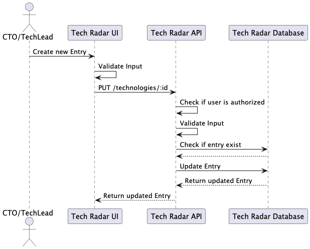
## Scenario 5: Entwurf anpassen
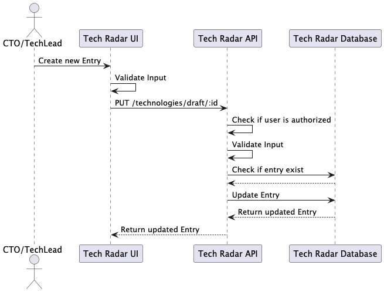
## Scenario 6: Entwurf publizieren
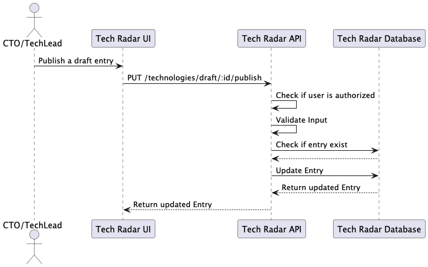
## Scenario 7: Eintrag löschen
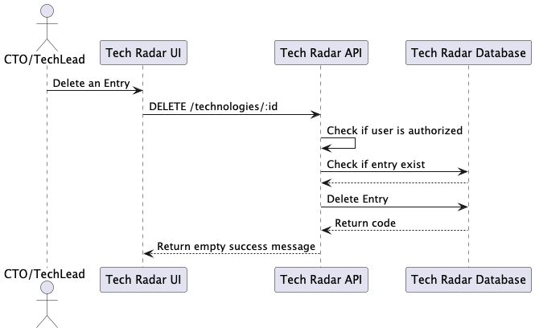

# 7. Verteilungssicht 
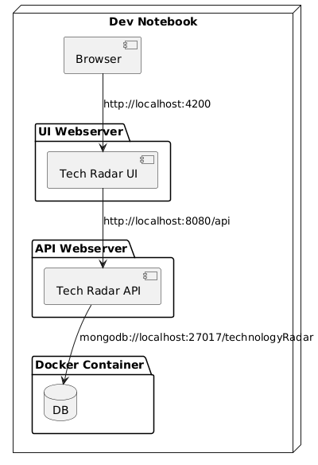

Im Rahmen vom Projekt war nicht vorgesehen eine "deploybare" Applikation zu entwickeln, wäre jedoch mit kleineren Anpassungen schnell gemacht.

# 8. Querschnittliche Konzepte
Dieses Kapitel beschreibt die querschnittlichen Konzepte der TechRadar-App, die sich durch die gesamte Architektur ziehen.

## 8.1 Dependency Injection (DI) für API und Datenbank

Die API verwendet Dependency Injection, um die Anbindung an die Datenbank zu abstrahieren und das Testen zu erleichtern.
Repository- und Service-Klassen werden über DI injiziert, sodass unterschiedliche Implementierungen (z. B. Mock-Datenbanken für Tests) genutzt werden können.

## 8.2 Sicherheit

Authentifizierung: JWT-basierte Authentifizierung mit Tokens, die in httpOnly-Cookies gespeichert werden, führt dazu, dass im Frontend-Javascript keine Manipulationen gemacht werden können.
Autorisierung: Rollenbasiertes Zugriffssystem (CTO, Tech-Lead, Mitarbeiter), umgesetzt in Guards (FE) und Middleware (BE).
CORS-Schutz: Die API akzeptiert nur Anfragen von erlaubten Frontend-Domänen (localhost:4200).

## 8.3 Logging
Wichtige Ereignisse (Logins von CTOs und Tech-Leads, API-Zugriffe) werden protokolliert.
Strukturierte Logs erleichtern die Fehleranalyse und das Monitoring.
Fehlerhafte Anfragen oder API-Fehler (z. B. 500 Internal Server Error) werden in einem zentralen Logging-Service erfasst.

# 8.4 Fehlerhandling
Fehlerhafte API-Anfragen lösen spezifische HTTP-Fehlercodes aus (z. B. 400 für ungültige Anfragen, 401 für nicht authentifizierte Zugriffe) - (authMiddleware).
Stacktraces vom Backend werden bewusst nur in der Applikation selbst geloggt und nicht ins UI übertragen.

# 8.5 Testing
**Unit-Tests**: Services und Repositories werden isoliert getestet, indem über DI Mock-Datenquellen verwendet werden.

# 8.6 Performance-Optimierung
Datenbankabfragen wurden optimiert, um unnötige Lese- und Schreiboperationen zu vermeiden.
Caching von häufig abgerufenen Daten verbessert die Ladezeiten (indexing)

# 9. Architekturentscheidungen

## Entscheidung: Verwendung von NX Monorepo
Alternative Optionen:
- Mehrere separate Repositories für Backend und Frontend 
- Monolithische Architektur

Begründung:
- Erleichtert die gemeinsame Nutzung von Modellen und DTOs zwischen Backend und Frontend. 
- Einheitliches Build- und Deployment-Management.
- Caching-Mechanismen helfen, dass die lokalen builds schneller durchlaufen 
- Bessere Unterstützung für modulare Entwicklung und Code-Wiederverwendung.
- Abhängikeiten sind mit tools wie nx graph schnell zu sehen (falls das Repo riesig wird)

## Entscheidung: JWT-basierte Authentifizierung
Alternative Optionen:
- Session-basierte Authentifizierung 
- OAuth2 mit externem Provider
- Keine Authentifizierung

Begründung:
- Ermöglicht eine skalierbare und stateless Authentifizierung. 
- Tokens werden sicher in httpOnly-Cookies gespeichert (statt in sessionStorage oder localStorage)

Für diesen Scope ist wurde ein IDP nicht eingebunden, da dies den Rahmen sprengen würde, deshalb wurde es simpel gehalten, wo die User-daten in der gleichen DB gespeichert werden.

## Entscheidung Verwendung von Dependency Injection (DI) in API und DB-Schicht

Alternative Optionen:
- Direkte Instanziierung von Services und Repositories

Begründung:
- Erhöht die Testbarkeit durch einfache Nutzung von Mocks. (IntegrationsTests werden wieder zu Unittests)
- Entkoppelt Komponenten, um spätere Änderungen zu erleichtern, falls plötzlich eine andere DB ausgewählt werden würde 
- Reduziert Abhängigkeiten und verbessert die Wartbarkeit.

## Entscheidung: Verwendung eines zentralen Logging-Services

Alternative Optionen:
- Kein zentrales Logging
- console.log..

Begründung:
- Erlaubt zentrale Fehleranalyse und Monitoring, standardisiert mit timestamp etc.

## Entscheidung: Modularer Aufbau
Alle zentralen Funktionen des Systems sind in modularen Services gekapselt.
Jeder Komponente ist unabhängig und kümmert sich ausschliesslich um seine spezifische Aufgabe.
Dies erhöht die Wartbarkeit, da Services unabhängig voneinander getestet und erweitert werden können.

# 10. Qualitätsanforderungen

| Priorität | Merkmal                            | Beschreibung                                                                                                                                      |
|-----------|------------------------------------|---------------------------------------------------------------------------------------------------------------------------------------------------|
| Hoch      | Sicherheit                         | Die Anwendung nutzt JWT-Authentifizierung mit httpOnly-Cookies und RBAC. Alle sicherheitskritischen (Admin logins) Aktionen werden protokolliert. |
| Hoch      | Wartbarkeit                        | Durch die NX-Monorepo-Struktur, Dependency Injection und eine modulare Architektur ist die Wartung und Erweiterung der Anwendung einfach möglich. |
| Mittel    | Performance                        | Die Nutzung von optimierten Datenbankabfragen und authCaching im Frontend gewährleisten eine schnelle Applikation                                 |
| Mittel    | Benutzerfreundlichkeit             | Einfaches UI bei dem ein normaler User und ein Admin nur einen kleinen Unterschied macht in der Bedienung                                         |
| Hoch      | Benutzerfreundlichkeit             | Der Technologie-Radar-Viewer soll neben der Desktop-Ansicht, auch für die Mobile-Ansicht optimiert sein.                                          |
| Hoch      | Benutzerfreundlichkeit/Performance | Der Technologie-Radar-Viewer soll innert 1s geladen sein.                                                                                         |
| Hoch      | Sicherheit/Nachvollziehbarkeit     | Sämtliche Anmeldungen an die Technologie-Radar-Administration werden aufgezeichnet.                                                               |

# 11. Risiken und technische Schulden

## 11.1 Risiken
| ID | Beschreibung                                     | Auswirkung                                                                                          | Gegenmassnahmen                                                                             |
|----|--------------------------------------------------|-----------------------------------------------------------------------------------------------------|---------------------------------------------------------------------------------------------|
| R1 | Sicherheitsrisiko durch JWT in Cookies           | Falls httpOnly-Cookies kompromittiert werden, kann ein Angreifer sich als Nutzer ausgeben.          | Zusätzliche Absicherung durch kurze Token-Lebensdauer und regelmässige Token-Invalidierung. |
| R2 | Fehlende API-Dokumentation                       | Ohne klare API-Dokumentation können Integrationen und Wartung erschwert werden.                     | OpenAPI-Spezifikationen konsequent pflegen und dokumentieren, im besten Fall automatisiert  |
| R3 | Dateninkonsistenz durch gleichzeitige Änderungen | Wenn mehrere Benutzer gleichzeitig Daten bearbeiten, können unerwartete Überschreibungen auftreten. | Transaktionen einbauen                                                                      |
| R4 | Duplizierte Validierung (BE & FE)                | Beeinträchtigt Single Source of Truth und kann in Zukunft zu Bug führen.                            | Validierung konsolidieren                                                                   |

## 11.1 Technical Depth

| ID | Beschreibung                   | Auswirkung                                                                                                              | Reduktionsstrategie                                                                              |
|----|--------------------------------|-------------------------------------------------------------------------------------------------------------------------|--------------------------------------------------------------------------------------------------|
| T1 | Unvollständige Testabdeckung   | Niedrige Code-Coverage kann zu unerwarteten Fehlern in Produktion führen.                                               | Unit- und Integrationstests weiter ausbauen, Ziel: 80% Code-Coverage. (aktuell 68%)              |
| T2 | Kein E2E-Tests                 | Mögliche unerwartete Fehler im Zusammenspiel von UI, API und Datenbank, die erst in Produktion entdeckt werden.         | Einführung von E2E-Tests zur Sicherstellung von Use-Cases und zur frühzeitigen Fehlererkennung.  |
| T3 | Keine Controller-Service-Tests | Schnittstellen zwischen Controller und Service könnten ungetestete Fehler enthalten, was zu unerwarteten Fehlern führt. | Implementierung von Integrations-Tests zur Stabilitätssicherung zwischen Controller und Service. |
| T3 | @ts-ignore                     | Kann zu unerwarteten Fehlern führen                                                                                     | Typescript Fehlermeldungen beheben und Typescript-Standards folgen (aktuell 5.Stück)             |

## Massnahmen
Für eine lokale Entwicklung ist die Applikation nicht schlecht, jedoch müssten noch die Risiken und Tech-Depth mitigiert und das CI/CD erweitert werden damit es produktionsreif ist

# 12. Glossar (generiert)
| Begriff                                                  | Definition                                                                                                                                |
|----------------------------------------------------------|-------------------------------------------------------------------------------------------------------------------------------------------|
| **Monorepo**                                             | Ein Repository, das mehrere Projekte enthält und mit NX verwaltet wird.                                                                   |
| **NX**                                                   | Ein Tool zur Verwaltung von Monorepos, das Modularität und Wiederverwendbarkeit erleichtert.                                              |
| **JWT (JSON Web Token)**                                 | Ein Token, das für die Authentifizierung verwendet wird und in einem httpOnly-Cookie gespeichert ist.                                     |
| **httpOnly-Cookie**                                      | Ein Cookie, das nur vom Server ausgelesen werden kann und nicht durch JavaScript manipuliert werden kann.                                 |
| **RBAC (Role-Based Access Control)**                     | Ein Autorisierungssystem, bei dem Benutzerrollen definiert werden, um den Zugriff auf bestimmte Funktionen zu steuern.                    |
| **Dependency Injection (DI)**                            | Ein Designmuster, das die Abhängigkeiten eines Moduls durch externe Bereitstellung kapselt, um Testbarkeit und Wartbarkeit zu verbessern. |
| **CI/CD (Continuous Integration/Continuous Deployment)** | Ein Entwicklungsprozess, bei dem Codeänderungen automatisch getestet und bereitgestellt werden.                                           |
| **ExpressJS**                                            | Ein minimalistisches Web-Framework für Node.js, das zur Erstellung von REST-APIs genutzt wird.                                            |
| **REST-API**                                             | Eine Architektur für Webdienste, die über HTTP-Anfragen kommuniziert.                                                                     |
| **Middleware**                                           | Eine Softwarekomponente, die HTTP-Anfragen abfängt und verarbeitet (z. B. für Authentifizierung oder Logging).                            |
| **MongoDB**                                              | Eine dokumentenbasierte NoSQL-Datenbank, die JSON-ähnliche Dokumente speichert.                                                           |
| **Codecov**                                              | Ein Tool zur Analyse der Codeabdeckung von Tests in einem Projekt.                                                                        |
| **E2E-Tests (End-to-End-Tests)**                         | Tests, die das gesamte System aus Benutzersicht simulieren und Fehler in der Integration von Komponenten aufdecken.                       |
| **Integrationstests**                                    | Tests, die überprüfen, ob verschiedene Module oder Systeme korrekt zusammenarbeiten.                                                      |
| **Unit-Tests**                                           | Tests, die einzelne Funktionen oder Klassen isoliert überprüfen.                                                                          |
| **OpenAPI**                                              | Eine Spezifikation zur Dokumentation und Definition von REST-APIs.                                                                        |
| **Audit Log**                                            | Eine Protokollierung sicherheitskritischer Aktionen, wie z. B. Admin-Logins oder API-Zugriffe.                                            |
| **Transaktionen**                                        | Mechanismen zur Sicherstellung der Datenkonsistenz bei gleichzeitigen Änderungen in der Datenbank.                                        |

